<!-- ===================== SUPER PROFILE HEADER ===================== -->

 

  

<!-- ===================== PROFILE SNAPSHOT ===================== -->
## Profile Snapshot

<table>
  <tr>
    <td width="33%" align="center">
      <b>Build Mode</b> 
      Full-stack products with clean UI, practical APIs, and thoughtful data flow.
    </td>
    <td width="33%" align="center">
      <b>Learning Mode</b> 
      Front-end polish, back-end depth, databases, deployment, and better developer workflows.
    </td>
    <td width="33%" align="center">
      <b>Craft Mode</b> 
      Reliable code, useful products, smooth user experiences, and constant iteration.
    </td>
  </tr>
</table>

<!-- ===================== ABOUT ME ===================== -->
## &#x1F468;&#x200D;&#x1F4BB; About Me

- &#x1F52D; I'm a **Full-Stack Developer** who loves turning ideas into clean, working products.
- &#x1F331; Currently leveling up my skills across the **front-end and back-end** stack.
- &#x1F4AC; Ask me about **JavaScript, React, Node.js, Python, Java, PHP & databases**.
- &#x26A1; Fun fact: I believe great software is equal parts logic and craftsmanship.

<!-- ===================== CONNECT ===================== -->
## &#x1F310; Connect With Me

  
  
  
  

<!-- ===================== TECH STACK ===================== -->
## &#x1F6E0;&#xFE0F; Tech Stack

<table>
  <tr>
    <td width="50%" valign="top">
      <h3 align="center">Languages</h3>
      

        
        
        
        
        
        
        
      

    </td>
    <td width="50%" valign="top">
      <h3 align="center">Frameworks & Libraries</h3>
      

        
        
        
        
        
        
      

    </td>
  </tr>
  <tr>
    <td width="50%" valign="top">
      <h3 align="center">Databases & Cloud</h3>
      

        
        
        
        
      

    </td>
    <td width="50%" valign="top">
      <h3 align="center">Tools</h3>
      

        
        
        
        
        
      

    </td>
  </tr>
</table>

<!-- ===================== FEATURED BUILD STYLE ===================== -->
## Build Style

<table>
  <tr>
    <td align="center"><b>Clean UI</b> Interfaces that feel simple, useful, and easy to scan.</td>
    <td align="center"><b>Solid APIs</b> Back-end logic that is readable, reusable, and dependable.</td>
    <td align="center"><b>Better Flow</b> Tools and habits that make building smoother every week.</td>
  </tr>
</table>

<!-- ===================== GITHUB STATS ===================== -->
## &#x1F4CA; GitHub Stats

<table>
  <tr>
    <td>
      
    </td>
    <td>
      
    </td>
  </tr>
  <tr>
    <td colspan="2" align="center">
      
    </td>
  </tr>
</table>

<!-- ===================== TROPHIES ===================== -->
## &#x1F3C6; GitHub Trophies

<!-- ===================== ORIGINAL HERO ART ===================== -->
## Original Coding Artwork

<!-- ===================== FOOTER ===================== -->

### &#x2728; Thanks for visiting! Let's build something great together. &#x2728;

